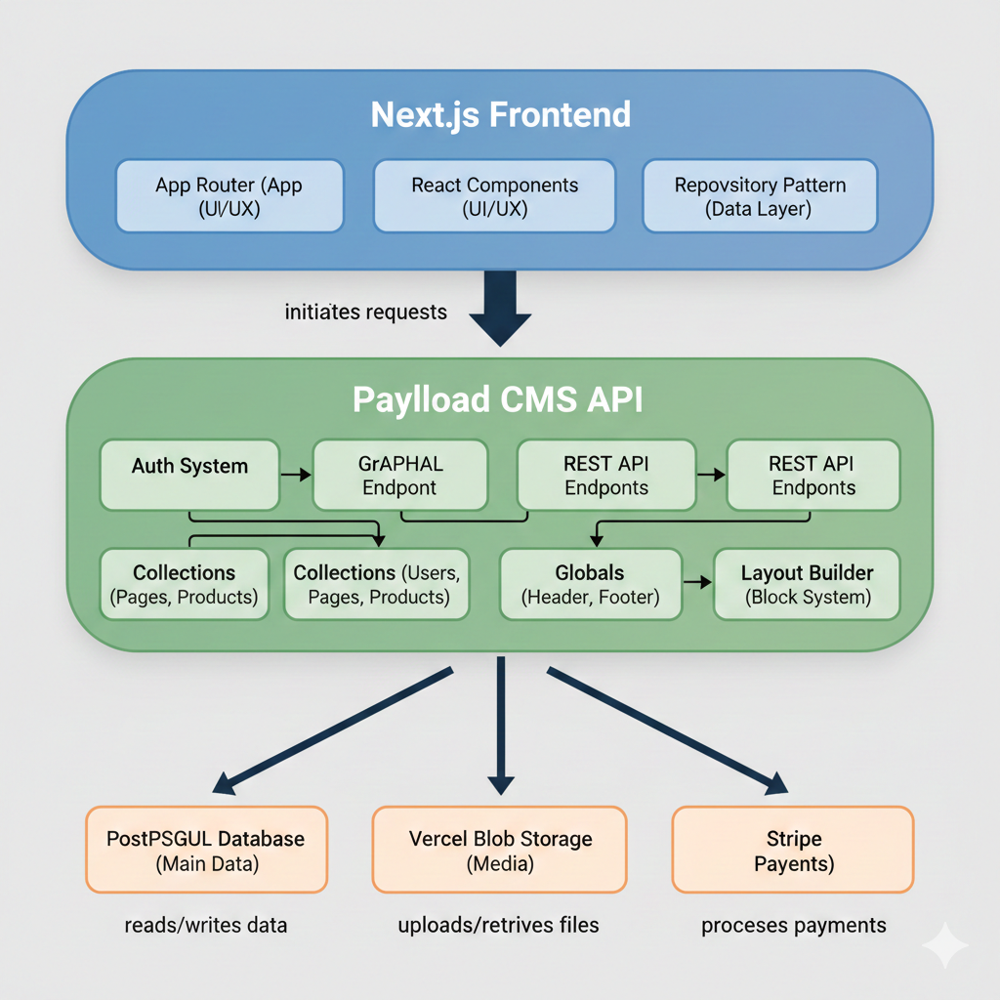

# Payload Ecommerce Customized By Yago López

This is a customized fork of the official [Payload Ecommerce](https://github.com/payloadcms/payload/blob/main/templates/ecommerce) template, featuring a robust backend, an enterprise-grade admin panel, and a production-ready e-commerce website.

## Demo

- https://payload-ecommerce-postgres-neon.vercel.app

## Key Technologies

-   **Frontend:** Next.js (App Router), React, TypeScript, TailwindCSS, shadcn/ui
-   **Backend:** Payload CMS
-   **Database:** PostgreSQL (`@payloadcms/db-postgres`)
-   **Styling:** TailwindCSS
-   **Deployment:** Vercel (with Vercel Blob Storage and Vercel Postgres adapter)

## Improvements

-   Bug fixes
-   Enhanced Architecture: 
    -   React Server Components for data loading
    -   Data Abstraction Layer using Repository Pattern
-   Improved performance
-   User interface enhancements

## Architecture



## Core Features

-   Authentication & Access Control
-   Layout Builder with Lexical editor
-   Draft & Live Preview
-   On-demand Revalidation
-   SEO (via Payload SEO Plugin)
-   Search & Filters
-   Products, Variants, Carts, Orders & Transactions
-   Stripe Payments
-   Automated E2E and Integration Tests

## Development Setup

1.  **Clone the repository:**
    ```bash
    git clone https://github.com/YagoLopez/payload-ecommerce-postgres-neon.git
    cd payload-ecommerce-postgres-neon
    ```
2.  **Environment Variables:**
    ```bash
    cp .env.example .env
    ```
    (Configure your `.env` file with database connection string, Payload secret, Stripe keys, etc.)
3.  **Install Dependencies & Start Development Server:**
    ```bash
    pnpm install
    pnpm dev
    ```
    Open `http://localhost:3000` in your browser. Follow on-screen instructions to create an admin user.

## Testing

-   **Run Integration Tests (Vitest):**
    ```bash
    pnpm test:int
    ```
-   **Run End-to-End Tests (Playwright):**
    ```bash
    pnpm test:e2e
    ```
-   **Run All Tests:**
    ```bash
    pnpm test
    ```

## Production Build & Start

1.  **Build the project:**
    ```bash
    pnpm build
    ```
2.  **Start the production server:**
    ```bash
    pnpm start
    ```
