# Detailed Component Breakdown & Relationships

## Component Architecture Overview

This document provides a comprehensive breakdown of all components in the Payload Ecommerce project, showing their relationships and interactions.

## Component Hierarchy & Relationships

```mermaid
graph TB
    subgraph "🏗️ Core Application Structure"
        APP[App Root]
        PROVIDERS[Context Providers]
        LAYOUT[App Layouts]
        PAGES[Page Components]
    end
    
    subgraph "🏢 Context Providers"
        THEME_PROVIDER[🎨 Theme Provider]
        AUTH_PROVIDER[🔐 Auth Provider]
        ECOM_PROVIDER[🛍️ Ecommerce Provider]
        SONNER_PROVIDER[🔔 Sonner Provider]
    end
    
    subgraph "🧭 Layout Components"
        HEADER[🧭 Header Component]
        FOOTER[📄 Footer Component]
        MOBILE_MENU[📱 Mobile Menu]
    end
    
    subgraph "🛍️ Ecommerce Components"
        CART[🛒 Cart System]
        PRODUCT[📦 Product Components]
        CHECKOUT[💳 Checkout Flow]
        SEARCH[🔍 Search System]
    end
    
    subgraph "👤 User Management"
        FORMS[📋 Form Components]
        AUTH[🔐 Authentication]
        ACCOUNT[👤 Account Management]
        ORDER[📋 Order Management]
    end
    
    subgraph "🎨 UI Components"
        UI_BASE[🎨 Base UI Components]
        MEDIA[🖼️ Media Components]
        RICHTEXT[📝 Rich Text Editor]
        LOADING[⏳ Loading States]
    end
    
    subgraph "⚙️ Admin Components"
        ADMIN_BAR[📊 Admin Bar]
        BEFORE_LOGIN[🚪 Before Login]
        BEFORE_DASHBOARD[🏠 Before Dashboard]
    end
    
    APP --> PROVIDERS
    APP --> LAYOUT
    APP --> PAGES
    
    LAYOUT --> HEADER
    LAYOUT --> FOOTER
    LAYOUT --> MOBILE_MENU
    
    HEADER --> SEARCH
    HEADER --> CART
    HEADER --> AUTH
    
    FORMS --> AUTH
    FORMS --> ACCOUNT
    FORMS --> CHECKOUT
    
    CHECKOUT --> PRODUCT
    CHECKOUT --> CART
    CHECKOUT --> ORDER
    
    UI_BASE --> MEDIA
    UI_BASE --> RICHTEXT
    UI_BASE --> LOADING
```



## Component Relationship Matrix

| Component Category | Primary Components | Dependencies | Used By |
|-------------------|-------------------|--------------|---------|
| **Layout** | Header, Footer, MobileMenu | Auth Provider, Search | All pages |
| **Cart** | CartModal, AddToCart, CartItem | Ecommerce Provider | Product pages, Checkout |
| **Product** | ProductGridItem, ProductItem, Gallery | Media Components | Shop, Home |
| **Checkout** | CheckoutPage, ConfirmOrder | Cart, Forms, Stripe | Checkout flow |
| **Authentication** | LoginForm, CreateAccountForm | Auth Provider | Login, Account |
| **Account** | AccountForm, OrderItem | Auth Provider, Orders | Account pages |
| **Search** | Search, Categories, Filter | Ecommerce Provider | Shop pages |
| **Forms** | FormItem, FormError | All forms | Checkout, Account, Auth |
| **Admin** | AdminBar, BeforeDashboard | Payload Admin | Admin interface |
| **UI** | Button, Card, Dialog | All components | Universal |

## Detailed Component Breakdown

### 1. Layout Components

```mermaid
graph TB
    subgraph "🧭 Layout System"
        HEADER_MAIN[Header]
        FOOTER_MAIN[Footer]
        MOBILE_MENU[MobileMenu]
        ADMIN_BAR[AdminBar]
    end
    
    subgraph "Header Components"
        SEARCH_COMP[Search]
        CART_HEADER[Cart Button]
        ACCOUNT_NAV[AccountNav]
        LOGO[Logo]
    end
    
    subgraph "Navigation"
        CATEGORIES[CategoryTabs]
        FILTER[FilterList]
        MOBILE_ITEMS[Mobile Menu Items]
    end
    
    HEADER_MAIN --> SEARCH_COMP
    HEADER_MAIN --> CART_HEADER
    HEADER_MAIN --> ACCOUNT_NAV
    HEADER_MAIN --> LOGO
    
    MOBILE_MENU --> CATEGORIES
    MOBILE_MENU --> MOBILE_ITEMS
    MOBILE_MENU --> FILTER
```


### 2. Cart & Ecommerce System


### 3. Checkout & Payment Flow


### 4. Authentication & User Management

```mermaid
graph TB
    subgraph "🔐 Authentication"
        LOGIN_FORM[LoginForm]
        CREATE_ACCOUNT[CreateAccountForm]
        FORGOT_PASSWORD[ForgotPasswordForm]
        BEFORE_LOGIN[BeforeLogin]
    end
    
    subgraph "👤 User Account"
        ACCOUNT_FORM[AccountForm]
        ACCOUNT_NAV[AccountNav]
        BEFORE_DASHBOARD[BeforeDashboard]
    end
    
    subgraph "Account Sections"
        ACCOUNT_PAGE[Account Page]
        ADDRESSES_PAGE[Addresses Page]
        ORDERS_PAGE[Orders Page]
        ORDER_DETAIL[Order Detail]
    end
    
    LOGIN_FORM --> BEFORE_LOGIN
    CREATE_ACCOUNT --> FORGOT_PASSWORD
    
    ACCOUNT_FORM --> ACCOUNT_NAV
    ACCOUNT_NAV --> ACCOUNT_PAGE
    ACCOUNT_NAV --> ADDRESSES_PAGE
    ACCOUNT_NAV --> ORDERS_PAGE
    ORDERS_PAGE --> ORDER_DETAIL
```


### 5. Content & Media Management

```mermaid
graph TB
    subgraph "🖼️ Media System"
        MEDIA_COMPONENT[Media Component]
        MEDIA_IMAGE[Image Component]
        MEDIA_VIDEO[Video Component]
        MEDIA_BLOCK[MediaBlock]
    end
    
    subgraph "📝 Content System"
        RICHTEXT[Richtext]
        CODE_BLOCK[CodeBlock]
        BANNER_BLOCK[BannerBlock]
        CTA_BLOCK[CallToActionBlock]
        CAROUSEL[Carousel]
        CONTENT_BLOCK[Content Block]
    end
    
    subgraph "📄 Pages & Collections"
        COLLECTION_ARCHIVE[CollectionArchive]
        GRID_COMPONENT[Grid Component]
        TILE[Grid Tile]
        LABEL[Grid Label]
    end
    
    MEDIA_COMPONENT --> MEDIA_IMAGE
    MEDIA_COMPONENT --> MEDIA_VIDEO
    MEDIA_COMPONENT --> MEDIA_BLOCK
    
    RICHTEXT --> CODE_BLOCK
    RICHTEXT --> BANNER_BLOCK
    RICHTEXT --> CTA_BLOCK
    RICHTEXT --> CAROUSEL
    RICHTEXT --> CONTENT_BLOCK
    
    GRID_COMPONENT --> TILE
    GRID_COMPONENT --> LABEL
    COLLECTION_ARCHIVE --> GRID_COMPONENT
```


### 6. UI & Form Components


## Component Dependencies & Data Flow


## Provider Architecture

```mermaid
graph TB
    subgraph "🏢 Context Providers Hierarchy"
        THEME_PROVIDER[Theme Provider]
        AUTH_PROVIDER[Auth Provider]
        HEADER_THEME[Header Theme Provider]
        SONNER_PROVIDER[Sonner Provider]
        ECOM_PROVIDER[Ecommerce Provider]
    end
    
    subgraph "Ecommerce Provider Details"
        CART_STATE[Cart State]
        PRODUCT_STATE[Product State]
        CHECKOUT_STATE[Checkout State]
        PAYMENT_METHODS[Payment Methods]
    end
    
    subgraph "Auth Provider Details"
        USER_STATE[User State]
        SESSION_STATE[Session State]
        PERMISSIONS[Permissions]
    end
    
    THEME_PROVIDER --> HEADER_THEME
    AUTH_PROVIDER --> ECOM_PROVIDER
    SONNER_PROVIDER --> ECOM_PROVIDER
    HEADER_THEME --> ECOM_PROVIDER
    
    ECOM_PROVIDER --> CART_STATE
    ECOM_PROVIDER --> PRODUCT_STATE
    ECOM_PROVIDER --> CHECKOUT_STATE
    ECOM_PROVIDER --> PAYMENT_METHODS
    
    AUTH_PROVIDER --> USER_STATE
    AUTH_PROVIDER --> SESSION_STATE
    AUTH_PROVIDER --> PERMISSIONS
```



## Collection & Page Structure

```mermaid
graph TB
    subgraph "📄 App Router Structure"
        APP_LAYOUT[App Layout]
        APP_PAGE[App Home]
        SHOP_LAYOUT[Shop Layout]
        ACCOUNT_LAYOUT[Account Layout]
        CHECKOUT_PAGE[Checkout]
        LOGIN_PAGE[Login]
        CREATE_ACCOUNT[Create Account]
    end
    
    subgraph "🛍️ Shop Pages"
        SHOP_HOME[Shop Home]
        PRODUCT_DETAIL[Product Detail]
        CATEGORY_PAGE[Category Pages]
    end
    
    subgraph "👤 Account Pages"
        ACCOUNT_HOME[Account Home]
        ADDRESSES[Addresses]
        ORDERS[Orders]
        ORDER_DETAIL[Order Detail]
    end
    
    subgraph "🔐 Auth Pages"
        LOGIN[Login]
        LOGOUT[Logout]
        FORGOT_PASSWORD[Forgot Password]
        FIND_ORDER[Find Order]
    end
    
    APP_LAYOUT --> APP_PAGE
    APP_LAYOUT --> SHOP_LAYOUT
    APP_LAYOUT --> ACCOUNT_LAYOUT
    APP_LAYOUT --> CHECKOUT_PAGE
    APP_LAYOUT --> LOGIN_PAGE
    APP_LAYOUT --> CREATE_ACCOUNT
    
    SHOP_LAYOUT --> SHOP_HOME
    SHOP_LAYOUT --> PRODUCT_DETAIL
    SHOP_LAYOUT --> CATEGORY_PAGE
    
    ACCOUNT_LAYOUT --> ACCOUNT_HOME
    ACCOUNT_LAYOUT --> ADDRESSES
    ACCOUNT_LAYOUT --> ORDERS
    ORDERS --> ORDER_DETAIL
    
    LOGIN_PAGE --> LOGIN
    LOGIN_PAGE --> LOGOUT
    LOGIN_PAGE --> FORGOT_PASSWORD
    LOGIN_PAGE --> FIND_ORDER
```



## Key Component Interactions

### 1. Product to Cart Flow
```
ProductItem → AddToCart → CartModal → CartItem
     ↓
EcommerceProvider → CartState → Database
```

### 2. Checkout Flow
```
Cart → CheckoutPage → CheckoutForm → AddressForm → ConfirmOrder → Stripe
                                    ↓
                             EcommerceProvider → OrderState
```

### 3. Authentication Flow
```
LoginForm → AuthProvider → UserState → Protected Routes
     ↓
CreateAccountForm → UserCreation → Database
```

### 4. Search & Filter Flow
```
Search → Categories → FilterList → ProductGrid
     ↓
EcommerceProvider → ProductState → API Calls
```

## Component Performance Considerations

### Lazy Loading Components
- **Shop pages** - Product listings loaded on demand
- **Account sections** - Individual pages loaded separately
- **Media components** - Images loaded with intersection observer
- **Admin components** - Loaded only for admin users

### State Management
- **Cart state** - Persisted to localStorage and database
- **User authentication** - Session-based with JWT tokens
- **Theme state** - Stored in localStorage
- **Search filters** - URL-based for shareable links

### Component Reusability
- **UI components** - Highly reusable across all features
- **Form components** - Shared validation and error handling
- **Media components** - Consistent image/video handling
- **Layout components** - Consistent navigation and structure

This detailed breakdown provides a comprehensive understanding of how all components interact within the Payload Ecommerce architecture, ensuring maintainable and scalable code structure.
