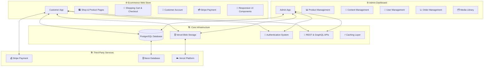
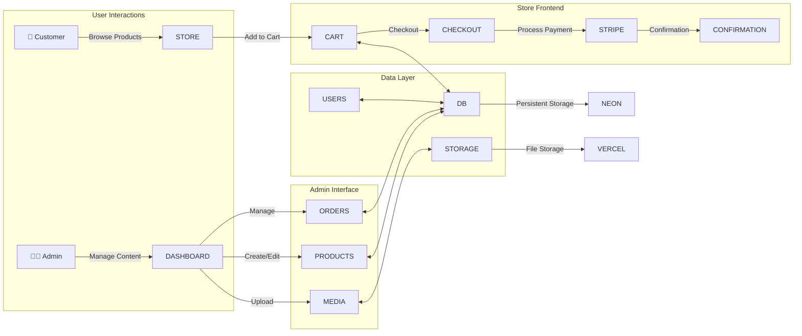
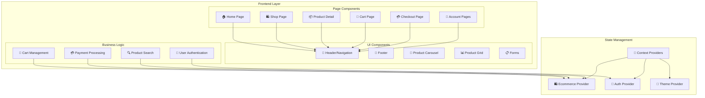
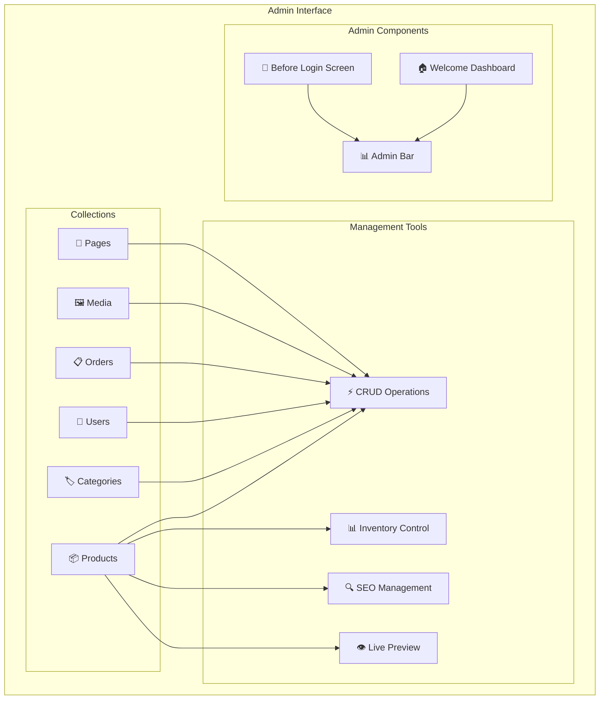
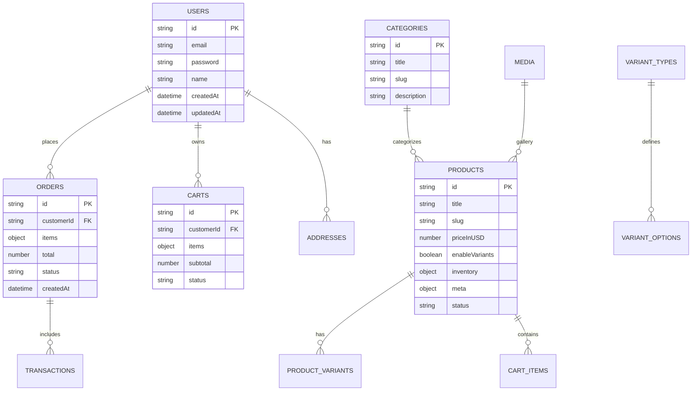

# Payload Ecommerce Project Architecture

## Overview
This project is a comprehensive ecommerce solution built on **Payload CMS** with **Next.js 15**, featuring two distinct but interconnected applications:

1. **Ecommerce Web Store** - Customer-facing storefront
2. **Admin Dashboard** - Content and store management interface

## High-Level Architecture



## Data Flow Architecture



## Component Architecture

### 1. Ecommerce Web Store Architecture



### 2. Admin Dashboard Architecture



## Database Schema



## Technology Stack

### Frontend Technologies
- **Next.js 15** - React framework with App Router
- **React 19** - UI library
- **TypeScript** - Type safety
- **Tailwind CSS 4** - Styling framework
- **Radix UI** - Component primitives
- **Lucide React** - Icon library

### Backend & CMS
- **Payload CMS 3.59** - Headless CMS
- **PostgreSQL** - Primary database (Neon hosting)
- **Vercel Blob Storage** - Media storage
- **Stripe** - Payment processing

### Development Tools
- **TypeScript** - Type checking
- **ESLint** - Code linting
- **Prettier** - Code formatting
- **Playwright** - E2E testing
- **Vitest** - Unit testing

## Key Features

### Ecommerce Web Store
- ✅ **Product Catalog** with categories and variants
- ✅ **Shopping Cart** with persistent storage
- ✅ **Secure Checkout** with Stripe integration
- ✅ **User Authentication** and account management
- ✅ **Order History** and tracking
- ✅ **Responsive Design** for all devices
- ✅ **SEO Optimized** with meta tags
- ✅ **Live Preview** functionality

### Admin Dashboard
- ✅ **Content Management** for all entities
- ✅ **Product Management** with variants
- ✅ **Order Management** and processing
- ✅ **User Management** with roles
- ✅ **Media Library** management
- ✅ **SEO Management** tools
- ✅ **Live Preview** for content
- ✅ **Inventory Tracking**

## File Structure Overview

```
src/
├── app/                          # Next.js App Router
│   ├── (app)/                   # Ecommerce Store
│   │   ├── login/              # Customer login
│   │   ├── shop/               # Product catalog
│   │   ├── products/           # Product pages
│   │   ├── checkout/           # Checkout process
│   │   └── (account)/          # Customer account
│   └── (payload)/admin/        # Admin Dashboard
│       ├── admin/              # Admin interface
│       └── api/                # API routes
├── components/                  # React Components
│   ├── ui/                     # Reusable UI components
│   ├── forms/                  # Form components
│   ├── Cart/                   # Shopping cart
│   └── Header/                 # Navigation
├── collections/                 # Payload Collections
│   ├── Products/               # Product management
│   ├── Users/                  # User management
│   ├── Categories/             # Category management
│   └── Media/                  # Media management
├── providers/                   # Context Providers
│   ├── Auth/                   # Authentication
│   ├── Ecommerce/              # Ecommerce state
│   └── Theme/                  # Theme management
└── plugins/                     # Payload Plugins
```

This architecture provides a robust, scalable foundation for a modern ecommerce application with clear separation of concerns between the customer-facing store and the administrative interface.
