# Payload Ecommerce Project Architecture

## Overview
This project is a comprehensive ecommerce solution built on **Payload CMS** with **Next.js 15**, featuring two distinct but interconnected applications:

1. **Ecommerce Web Store** - Customer-facing storefront
2. **Admin Dashboard** - Content and store management interface

## High-Level Architecture

```mermaid
graph TB
    subgraph "🌐 Ecommerce Web Store"
        ES[Customer App]
        ES1[🛍️ Shop & Product Pages]
        ES2[🛒 Shopping Cart & Checkout]
        ES3[👤 Customer Account]
        ES4[💳 Stripe Payment]
        ES5[📱 Responsive UI Components]
    end
    
    subgraph "⚙️ Admin Dashboard"
        AD[Admin App]
        AD1[📊 Product Management]
        AD2[📝 Content Management]
        AD3[👥 User Management]
        AD4[📈 Order Management]
        AD5[🗂️ Media Library]
    end
    
    subgraph "🏗️ Core Infrastructure"
        DB[(PostgreSQL Database)]
        STORAGE[🗄️ Vercel Blob Storage]
        AUTH[🔐 Authentication System]
        API[🔌 REST & GraphQL APIs]
        CACHE[⚡ Caching Layer]
    end
    
    subgraph "🛠️ Third-Party Services"
        STRIPE[💰 Stripe Payment]
        NEON[🗄️ Neon Database]
        VERCEL[☁️ Vercel Platform]
    end
    
    ES <--> AUTH
    ES <--> DB
    ES <--> STORAGE
    ES <--> STRIPE
    ES <--> API
    
    AD <--> AUTH
    AD <--> DB
    AD <--> STORAGE
    AD <--> API
    
    DB <--> NEON
    STORAGE <--> VERCEL
```



## Data Flow Architecture

```mermaid
flowchart LR
    subgraph "User Interactions"
        CUSTOMER[👤 Customer] --> |Browse Products| STORE
        ADMIN[👩‍💼 Admin] --> |Manage Content| DASHBOARD
    end
    
    subgraph "Store Frontend"
        STORE --> |Add to Cart| CART
        CART --> |Checkout| CHECKOUT
        CHECKOUT --> |Process Payment| STRIPE
        STRIPE --> |Confirmation| CONFIRMATION
    end
    
    subgraph "Admin Interface"
        DASHBOARD --> |Create/Edit| PRODUCTS
        DASHBOARD --> |Manage| ORDERS
        DASHBOARD --> |Upload| MEDIA
    end
    
    subgraph "Data Layer"
        PRODUCTS <--> DB
        ORDERS <--> DB
        CART <--> DB
        MEDIA <--> STORAGE
        USERS <--> DB
    end
    
    DB --> |Persistent Storage| NEON
    STORAGE --> |File Storage| VERCEL
```



## Component Architecture

### 1. Ecommerce Web Store Architecture


### 2. Admin Dashboard Architecture

```mermaid
graph TB
    subgraph "Admin Interface"
        subgraph "Collections"
            PRODUCTS_ADMIN[📦 Products]
            CATEGORIES_ADMIN[🏷️ Categories]
            USERS_ADMIN[👥 Users]
            ORDERS_ADMIN[📋 Orders]
            MEDIA_ADMIN[🖼️ Media]
            PAGES_ADMIN[📄 Pages]
        end
        
        subgraph "Management Tools"
            CRUD[⚡ CRUD Operations]
            PREVIEW[👁️ Live Preview]
            SEO[🔍 SEO Management]
            INVENTORY[📊 Inventory Control]
        end
        
        subgraph "Admin Components"
            BEFORE_LOGIN[🚪 Before Login Screen]
            BEFORE_DASHBOARD[🏠 Welcome Dashboard]
            ADMIN_BAR[📊 Admin Bar]
        end
    end
    
    PRODUCTS_ADMIN --> CRUD
    CATEGORIES_ADMIN --> CRUD
    USERS_ADMIN --> CRUD
    ORDERS_ADMIN --> CRUD
    MEDIA_ADMIN --> CRUD
    PAGES_ADMIN --> CRUD
    
    PRODUCTS_ADMIN --> INVENTORY
    PRODUCTS_ADMIN --> SEO
    PRODUCTS_ADMIN --> PREVIEW
    
    BEFORE_LOGIN --> ADMIN_BAR
    BEFORE_DASHBOARD --> ADMIN_BAR
```



## Database Schema


## Technology Stack

### Frontend Technologies
- **Next.js 15** - React framework with App Router
- **React 19** - UI library
- **TypeScript** - Type safety
- **Tailwind CSS 4** - Styling framework
- **Radix UI** - Component primitives
- **Lucide React** - Icon library

### Backend & CMS
- **Payload CMS 3.59** - Headless CMS
- **PostgreSQL** - Primary database (Neon hosting)
- **Vercel Blob Storage** - Media storage
- **Stripe** - Payment processing

### Development Tools
- **TypeScript** - Type checking
- **ESLint** - Code linting
- **Prettier** - Code formatting
- **Playwright** - E2E testing
- **Vitest** - Unit testing

## Key Features

### Ecommerce Web Store
- ✅ **Product Catalog** with categories and variants
- ✅ **Shopping Cart** with persistent storage
- ✅ **Secure Checkout** with Stripe integration
- ✅ **User Authentication** and account management
- ✅ **Order History** and tracking
- ✅ **Responsive Design** for all devices
- ✅ **SEO Optimized** with meta tags
- ✅ **Live Preview** functionality

### Admin Dashboard
- ✅ **Content Management** for all entities
- ✅ **Product Management** with variants
- ✅ **Order Management** and processing
- ✅ **User Management** with roles
- ✅ **Media Library** management
- ✅ **SEO Management** tools
- ✅ **Live Preview** for content
- ✅ **Inventory Tracking**

## File Structure Overview

```
src/
├── app/                          # Next.js App Router
│   ├── (app)/                   # Ecommerce Store
│   │   ├── login/              # Customer login
│   │   ├── shop/               # Product catalog
│   │   ├── products/           # Product pages
│   │   ├── checkout/           # Checkout process
│   │   └── (account)/          # Customer account
│   └── (payload)/admin/        # Admin Dashboard
│       ├── admin/              # Admin interface
│       └── api/                # API routes
├── components/                  # React Components
│   ├── ui/                     # Reusable UI components
│   ├── forms/                  # Form components
│   ├── Cart/                   # Shopping cart
│   └── Header/                 # Navigation
├── collections/                 # Payload Collections
│   ├── Products/               # Product management
│   ├── Users/                  # User management
│   ├── Categories/             # Category management
│   └── Media/                  # Media management
├── providers/                   # Context Providers
│   ├── Auth/                   # Authentication
│   ├── Ecommerce/              # Ecommerce state
│   └── Theme/                  # Theme management
└── plugins/                     # Payload Plugins
```

This architecture provides a robust, scalable foundation for a modern ecommerce application with clear separation of concerns between the customer-facing store and the administrative interface.
